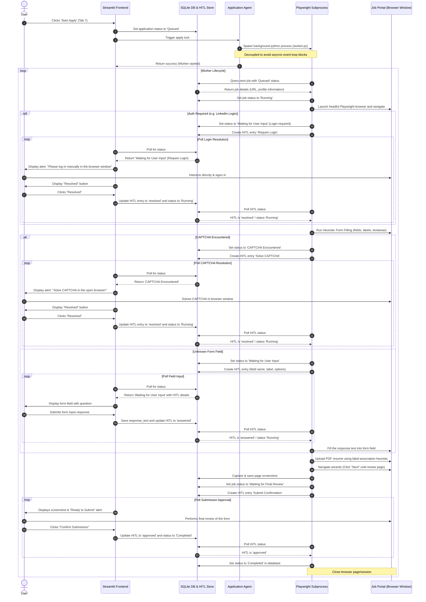

# Project Flowcharts: Technical and User Perspectives

This document visualizes the Resume to Job Application Agent System workflow from both the **User Perspective** (how a candidate interacts with the Streamlit wizard interface) and the **Technical Perspective** (how the hierarchical ADK agents, shared SQLite state, and decoupled background Playwright process interact).

---

## 1. User Perspective Flowchart

This flowchart tracks the step-by-step user journey across the 9-step Streamlit UI wizard, highlighting decision gates and Human-in-the-Loop (HITL) checkpoints.

```mermaid
graph TD
    %% Define styles
    classDef default fill:#1E1E2E,stroke:#CDD6F4,stroke-width:1px,color:#CDD6F4;
    classDef startEnd fill:#F5C2E7,stroke:#CBA6F7,stroke-width:2px,color:#11111B;
    classDef step fill:#89B4FA,stroke:#74C7EC,stroke-width:1px,color:#11111B;
    classDef decision fill:#F9E2AF,stroke:#F8BD96,stroke-width:1px,color:#11111B;
    classDef hitl fill:#F38BA8,stroke:#E78284,stroke-width:2px,color:#11111B;

    Start([Start: Open Streamlit App]) :::startEnd --> Step1[1. Resume Intake: Upload Resume PDF/Docx/Txt & enter LinkedIn URL] :::step
    Step1 --> Step2[2. ATS Score: View baseline score & job alignment breakdown] :::step
    Step2 --> Step3[3. Resume Improvements: Review suggested changes] :::step
    Step3 --> Dec1{Approve changes?} :::decision
    
    Dec1 -- Yes --> Act1[Apply changes & view projected score] :::step
    Dec1 -- No / Skip --> Step4[4. Job Search Criteria: Input target keywords, location, date posted] :::step
    
    Act1 --> Step4
    Step4 --> Step5[5. Job Matches: View ranked job listings & match %] :::step
    Step5 --> Step6[6. Auto-Apply Settings: Set match threshold & toggle auto-apply] :::step
    
    Step6 --> Dec2{Auto-apply enabled?} :::decision
    Dec2 -- Yes --> Step7[7. Application Tracker: Monitor background Playwright automation] :::step
    Dec2 -- No --> Step8[8. Lower-Match Review: Browse jobs below threshold] :::step
    
    Step8 --> Act2[Confirm experience for missing skills & write short notes] :::step
    Act2 --> Act3[System updates resume with confirmed details & re-scores] :::step
    Act3 --> Dec3{New match >= threshold?} :::decision
    Dec3 -- Yes --> Step7
    Dec3 -- No --> Step8
    
    Step7 --> Dec4{Automation Interrupted?} :::decision
    Dec4 -- Yes (CAPTCHA) --> Hitl1[User solves CAPTCHA in open headful browser window] :::hitl
    Dec4 -- Yes (Unknown Field) --> Hitl2[User answers unknown question in Streamlit form] :::hitl
    Dec4 -- No / Done --> Step9[9. Email Alerts: Configure SMTP settings & receive summary report] :::step
    
    Hitl1 --> Step7
    Hitl2 --> Step7
    
    Step9 --> End([End: Process Complete]) :::startEnd
```

---

## 2. Technical System Architecture Flowchart

This flowchart illustrates the relationships between the frontend Streamlit thread, the SQLite shared state, the hierarchical ADK agents (Coordinator and its subagents), the background Playwright process, and external services.

```mermaid
graph TB
    %% Styling
    classDef frontend fill:#89B4FA,stroke:#74C7EC,stroke-width:1px,color:#11111B;
    classDef backend fill:#A6E3A1,stroke:#94E2D5,stroke-width:1px,color:#11111B;
    classDef db fill:#F9E2AF,stroke:#F8BD96,stroke-width:2px,color:#11111B;
    classDef worker fill:#F2CDCD,stroke:#E8A2AF,stroke-width:1px,color:#11111B;
    classDef external fill:#CBA6F7,stroke:#CBA6F7,stroke-width:1px,color:#11111B;

    %% Subgraphs
    subgraph Frontend [Streamlit UI Process]
        ST[Streamlit Application Interface] :::frontend
        SessionState[Session State Cache] :::frontend
    end

    subgraph ADK [ADK Multi-Agent System]
        Coord[Coordinator Agent] :::backend
        ResumeAgent[Resume Agent] :::backend
        JobAlertAgent[Job Alerts / Job Intelligence Agent] :::backend
        AppAgent[Application Agent] :::backend
    end

    subgraph Storage [SQLite Database Layer]
        SQLiteDB[(SQLite Database File)] :::db
        HITLTable[("HITL Store (Questions & Status)")] :::db
    end

    subgraph Automation [Playwright Background Worker]
        Subproc[Subprocess Spawner] :::worker
        PlaywrightEngine[Playwright Engine] :::worker
        Heuristics[Heuristics Form Filler] :::worker
    end

    subgraph Ext [External Interfaces]
        LinkedIn[LinkedIn Portal] :::external
        OtherPortals["Greenhouse / Lever / Wellfound"] :::external
        SMTP[SMTP Email Server] :::external
    end

    %% Flow lines
    ST <-->|Read / Write UI configuration| SessionState
    ST -->|User inputs & requests| Coord
    
    %% Coordinator Delegation
    Coord -->|Delegate Resume parsing/optimization| ResumeAgent
    Coord -->|Delegate job search & matching| JobAlertAgent
    Coord -->|Delegate automation job| AppAgent
    
    %% Database integration
    Coord <-->|Write & Read State| SQLiteDB
    ST <-->|Poll state & statuses| SQLiteDB
    
    %% Playwright integration
    AppAgent -->|Spawn detached worker process| Subproc
    Subproc -->|Start execution loop| PlaywrightEngine
    PlaywrightEngine -->|Scrape / Apply| LinkedIn
    PlaywrightEngine -->|Apply| OtherPortals
    PlaywrightEngine <-->|Read & Update job status| SQLiteDB
    
    %% HITL Protocol
    Heuristics -->|Encounter CAPTCHA / unknown field| HITLTable
    ST <-->|Poll for active questions & display alert| HITLTable
    ST -->|Post answers / resolve captcha| HITLTable
    PlaywrightEngine <-->|Poll for resolution| HITLTable
    
    %% Notifications
    JobAlertAgent -->|Trigger alert HTML payload| SMTP
    SMTP -->|Dispatch notification email| UserEmail([User Email Inbox]) :::external
```

---

## 3. Decoupled Playwright Worker Lifecycle & SQLite Polling Protocol

This sequence diagram details the synchronization mechanism that allows Streamlit to trigger the automation agent as a separate background process, polling for updates and pausing when a manual intervention (HITL) is required.



---

## 4. Heuristic Form Filling Logic Flow

This flowchart outlines the decision steps executed by the **Application Agent's** Playwright worker to scan form elements, fill values from the candidate profile, upload files, navigate wizards, and enforce the final safety stop.

```mermaid
graph TD
    %% Styling
    classDef startEnd fill:#F5C2E7,stroke:#CBA6F7,stroke-width:2px,color:#11111B;
    classDef step fill:#89B4FA,stroke:#74C7EC,stroke-width:1px,color:#11111B;
    classDef decision fill:#F9E2AF,stroke:#F8BD96,stroke-width:1px,color:#11111B;
    classDef success fill:#A6E3A1,stroke:#94E2D5,stroke-width:1px,color:#11111B;

    Start([Start: Form filling triggered]) :::startEnd --> ScrapeFields[Locate all form input, textarea, select, checkbox, radio, and file elements] :::step
    ScrapeFields --> LoopFields[Loop through each interactive element] :::step
    LoopFields --> IdentifyElement[Analyze element: tag, type, labels, placeholders, aria-labels, and surrounding text] :::step
    IdentifyElement --> DecType{Is file upload?} :::decision
    
    DecType -- Yes --> SearchFileLabels[Search for 'Resume', 'CV', 'Attach' label or text] :::step
    SearchFileLabels --> FindInputFile{Is associated <input type='file'> visible/hidden found?} :::decision
    FindInputFile -- Yes --> SetFile[Set path of approved PDF resume directly on input] :::step
    FindInputFile -- No --> ClickTrigger[Click parent element/trigger button to expose input] :::step
    ClickTrigger --> SetFile
    
    DecType -- No --> MapProfile{Can map element indicators to candidate profile attributes?} :::decision
    MapProfile -- Yes --> MatchField[Retrieve value from profile: Name, Email, Phone, LinkedIn, Summary, etc.] :::step
    MatchField --> FillField[Fill/Select input value on the webpage] :::step
    
    MapProfile -- No --> HITLPrompt[Pause Playwright execution & write unknown field details to SQLite HITL table] :::step
    HITLPrompt --> PollHITL[Poll HITL table for user response] :::step
    PollHITL --> ReceivedInput[Retrieve user input value from SQLite] :::step
    ReceivedInput --> FillField
    
    SetFile --> CheckMore{More elements?} :::decision
    FillField --> CheckMore
    
    CheckMore -- Yes --> LoopFields
    CheckMore -- No --> WizardCheck{Is multi-page form wizard?} :::decision
    
    WizardCheck -- Yes --> ClickNext[Locate and click 'Next' or 'Continue' button] :::step
    ClickNext --> WaitReload[Wait for page load / frame stability] :::step
    WaitReload --> ScrapeFields
    
    WizardCheck -- No --> SafetyGate[Halt execution before the final submit button] :::success
    SafetyGate --> End([End Form Filling]) :::startEnd
```

---

## 5. Architectural Implementation Notes

### 5.1 Decoupled Subprocess Isolation
To bypass the typical `asyncio` loop collision where running Playwright's loop inside Streamlit blocks UI updates or crashes the app, the job application engine resides in a separate Python CLI program.
- Streamlit spawns this program using `subprocess.Popen([sys.executable, "app/worker.py"])`.
- Streamlit and the worker communicate solely through the SQLite database.

### 5.2 SQLite Communication Schema
The SQLite database stores the state of the active run. Essential tables are:
- `candidate_profile`: User parsed resume data.
- `job_postings`: Found job postings, source URLs, match scores, and status flags.
- `hitl_prompts`: Active Human-in-the-Loop questions, CAPTCHA statuses, responses, and resolution markers.

### 5.3 Safety Gatekeeping
The system implements a critical **Submission Safety Gate**:
- The Playwright worker navigates the portal, fills fields, uploads the resume, and goes to the "Review Application" page.
- Instead of clicking the final submit button, the worker saves a page screenshot, marks the job as `Waiting for Final Review`, and pauses.
- The user can review the open browser window and click a button in Streamlit or directly click "Submit" in the browser to conclude the application safely.
