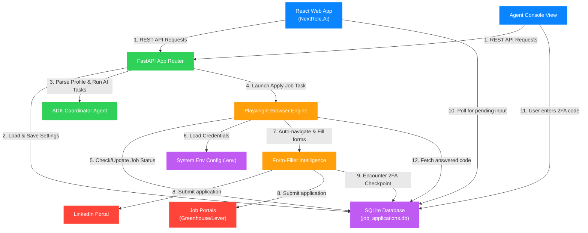
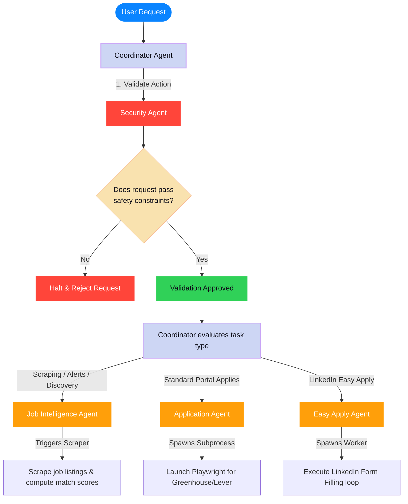

# NextRole.Ai: Autonomous Career & Job Application Agent

**NextRole.Ai** is an AI-powered, multi-agent copilot designed to automate your job application lifecycle. By combining a modern React dashboard, a FastAPI orchestrator, and an autonomous Playwright browser automation engine, NextRole.Ai scouts job listings, evaluates resume ATS match rates, and automatically fills out job applications while allowing you to handle 2FA checkpoints in real-time.

---

## 📂 Project Overview & Capabilities

### 1. Multi-Agents using ADK
NextRole.Ai uses the Google Agent Development Kit (ADK) to establish a hierarchical multi-agent structure. The system defines a parent Coordinator Agent (`root_agent`) that manages orchestration and delegates specific tasks like safety validation, job searching, and form automation to modular sub-agents.

### 2. Security Features
Security is enforced by a dedicated Security Agent that acts as the final validation gate before any browser task runs. It restricts virtual browser navigation strictly to `linkedin.com` and `www.linkedin.com`, whitelists allowed interaction steps, enforces application limits, and prevents sensitive resume information from being logged.

### 3. Agent Skills
System capabilities are split into specialized sub-agents with dedicated skills:
* **Resume Agent**: Handles parsing PDF resumes to extract structured experience, skills, and education, evaluates baseline ATS readiness, and suggests tailorable text improvements.
* **Job Intelligence Agent**: Handles target keyword job board scraping, scoring matches, and SMTP email alerts.
* **LinkedIn Form Filler Agent**: Focuses on browser automation inside LinkedIn, using intelligent heuristics to identify input fields, select dropdowns, handle radio options, and pre-fill multi-step Easy Apply forms.
* **Portal Application Agent**: Automates external company portal application forms (e.g. Greenhouse, Lever).
* **Security Agent**: Enforces validation gates on action types, input boundaries, and target domain whitelisting.

---

## 🚀 Key Features

* **💼 Dynamic Sidebar Navigation**: Uses a secure configuration gate. Advanced features (Job Discovery, Agent Console, ATS Optimizer) remain locked and disabled until your candidate profile is filled, settings are configured, and LinkedIn is connected.
* **📈 ATS Match Scorecard**: Automatically evaluates your resume's compatibility against role details in real-time (ranging from $45\%$ to $96\%$), highlighting key missing keywords.
* **🤖 Background Browser Robot**: Detaches Playwright browser instances headlessly to navigate login screens and multi-step portal forms (Greenhouse, Lever, LinkedIn).
* **💬 Human-in-the-Loop (HITL) 2FA**: If LinkedIn prompts for a 2-step verification PIN or OTP code, the background worker pauses, prompts you directly in the web UI console, and resumes automation instantly upon input.
* **✨ ATS Asset Optimizer**: Automatically generates professional cover letters, LinkedIn recruiter outreach drafts, and suggestions to optimize resume experience bullets with metrics.

---

## 🛠️ System Architecture

This diagram shows how the frontend user interface, backend server, database, and background browser automation interact:





### The System Flow (Layman's Terms)
Think of **NextRole.Ai** as a highly coordinated office:
1. **The Receptionist (React UI)**: Takes your profile, settings, and clicks.
2. **The Office Manager (FastAPI Backend)**: Receives commands and triggers AI agents.
3. **The Filing Cabinet (SQLite & .env)**: Remembers your preferences and application histories.
4. **The Assistant (Playwright Robot)**: Autonomously logs in and applies to jobs in the background, pausing when a verification code (2FA) is needed to ask the receptionist (and you) for help.

---

## 🤖 Agent Workflow & Routing

The following diagram tracks the flow of a user command through the security gates and sub-agent handoffs:





### Agent Roles:
* **Coordinator Agent**: Receives instructions and delegates to sub-agents.
* **Security Agent**: Validates target domains and sanitizes form inputs against safety guidelines.
* **Resume Agent**: Ingests resume files (PDF), parses structured candidate profiles, and generates ATS match scores.
* **Job Intelligence Agent**: Handles searching, job scraping, matching, and email alerting.
* **Application Agent**: Orchestrates background Playwright applications on portal forms (Greenhouse/Lever).
* **LinkedIn Form Filler Agent (Easy Apply Agent)**: Focuses on browser automation inside LinkedIn, using intelligent heuristics to fill text fields, select options, and navigate multi-step Easy Apply sequences with pre-populated candidate data.

---

## ⚙️ Getting Started & Setup

### 1. Configure the Backend Server
Navigate into the backend project, initialize the Python environment, and install dependencies:
```bash
cd job-alert-agent
python -m venv .venv
# On Windows PowerShell:
.venv\Scripts\Activate.ps1
# On macOS/Linux:
source .venv/bin/activate

pip install -r requirements.txt
playwright install chromium
```

Configure your credentials inside `job-alert-agent/adk_agents/.env`:
```env
LINKEDIN_USERNAME=your-email@example.com
LINKEDIN_PASSWORD=your-password
GEMINI_API_KEY=your-api-key
```

### 2. Build the Frontend App
Navigate into the frontend folder, install packages, and compile the production build:
```bash
cd ../frontend
npm install
npm run build
```

### 3. Launch the Application
Run the FastAPI backend server:
```bash
cd ../job-alert-agent
uv run python -m app.fast_api_app
```

Now, open your browser and navigate to **`http://localhost:8000`** to access NextRole.Ai!
