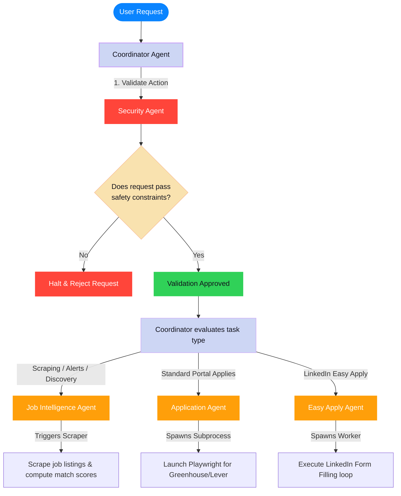

# NextRole.Ai Multi-Agent Workflow Guide

This document visualizes how the hierarchical AI agents in **NextRole.Ai** cooperate, validate requests, and delegate tasks to handle your job hunt automatically.

---

## 1. Agent Interaction & Routing Flowchart

The following diagram tracks the flow of a user command through the security gates and sub-agent handoffs:

---

## 2. Agent Capabilities & Roles

NextRole.Ai uses a hierarchical **Coordinator-Worker** structure where the root agent orchestrates sub-agents specialized in specific tasks:

### 1. Coordinator Agent (The Controller)
* **Model**: `gemini-3.1-flash-lite`
* **Role**: Acts as the system dispatcher. It receives all instructions, monitors user choices, and directs traffic to specialized sub-agents. It prevents loops and coordinates data updates.

### 2. Security Agent (The Guardrail)
* **Role**: Validates every request before any browser window is launched or data is sent.
* **Checks performed**:
  - Validates that target URLs are legitimate job boards (prevents navigation to phishing domains).
  - Screens inputs to ensure no malicious code or scripts are injected into forms.

### 3. Job Intelligence Agent (The Scout)
* **Role**: Handles finding and ranking jobs.
* **Responsibilities**:
  - Launches background scraping of search results.
  - Matches descriptions against your uploaded resume and preferences.
  - Computes matching weights and compiles HTML alert payloads to dispatch via SMTP email.

### 4. Application Agent (The Form Specialist)
* **Role**: Orchestrates general web application automation.
* **Responsibilities**:
  - Handles application forms hosted on platforms like Greenhouse, Lever, and other company portal systems.
  - Spawns background worker instances to execute multi-step form-filling wizards.

### 5. Easy Apply Agent (The LinkedIn Specialist)
* **Role**: Manages LinkedIn-specific automation.
* **Responsibilities**:
  - Focuses specifically on LinkedIn's dynamic "Easy Apply" process.
  - Automates credential submission, handles 2FA challenge screens via the Agent Console UI, fills screening questions, and safely pauses before final submission.
