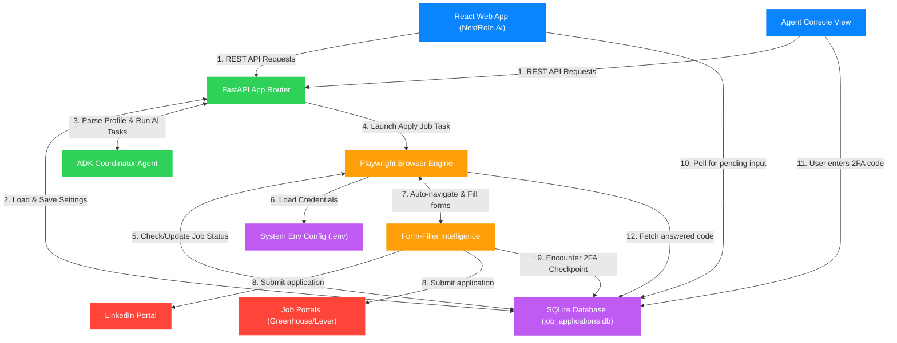

# NextRole.Ai Architecture Guide

This guide explains how **NextRole.Ai** works under the hood, translating the code structure into simple, layman-friendly concepts.

---

## 1. System Architecture Diagram

This diagram shows how the frontend user interface, backend server, database, and background browser automation interact:

---

## 2. Layman's Explanation (The Story of Your App)

Think of **NextRole.Ai** as a highly coordinated office with four main players:

### 💼 Player 1: The Receptionist (React Frontend)
* **Who they are**: This is the webpage you see in your browser (Dashboard, Configuration, Job Discovery, Agent Console, ATS Optimizer).
* **What they do**: They take your orders (e.g., when you upload your resume or write job preferences) and show you real-time updates. They don't do the heavy lifting; they just talk to the office staff.

### 🏢 Player 2: The Office Manager (FastAPI Backend)
* **Who they are**: This is the server running in the background.
* **What they do**: They receive the receptionist's orders and figure out who should execute them. They talk to the filing cabinet to save your profiles and launch the background tasks.

### 🗄️ Player 3: The Filing Cabinet (SQLite Database & .env)
* **Who they are**: This is the memory storage.
* **What they do**: It holds your decrypted credentials, search criteria, parsed resume text, and job logs. Even when the server restarts, this cabinet keeps your information safe.

### 🤖 Player 4: The Digital Assistant (Playwright Background Worker)
* **Who they are**: A background software robot.
* **What they do**: Once authorized, the assistant takes your credentials and goes to work:
  1. It opens a virtual web browser in the background.
  2. It navigates to LinkedIn and logs you in using the credentials in the cabinet.
  3. If LinkedIn asks for a **2-step verification code (2FA)**, the assistant writes a note in the cabinet: *"I need the verification code!"*
  4. The **Receptionist** polls the cabinet, sees the note, and displays a text box in the **Agent Console** prompting you: *"Please enter your 2FA code."*
  5. Once you enter it, the receptionist saves it in the cabinet, the assistant reads it, types it into LinkedIn, and successfully signs you in!
  6. The assistant then goes through the job matches, reads target descriptions, matches them against your skills, and automates form-filling tasks!
