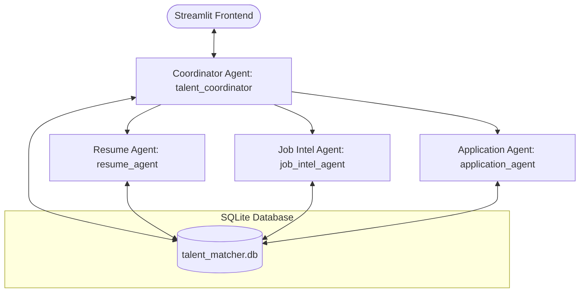
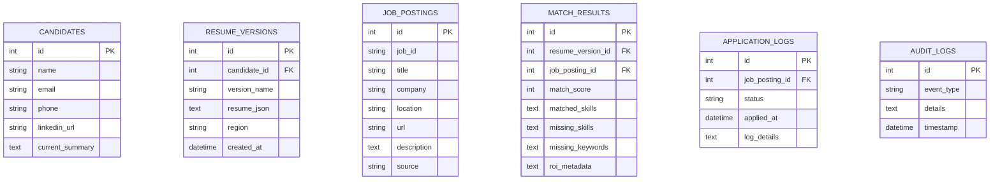

# Implementation Plan: Next-Generation Career Twin Agent (Resume & Job Intelligence Suite)

This document outlines the architecture, data design, and implementation roadmap for building the **Career Twin Agent**—a highly advanced, next-generation Resume & Job Description Agent. It merges the existing semantic matching code with 13 innovative features, wrapped in a premium, modern glassmorphism Streamlit dashboard and a robust FastAPI backend powered by the Google Agent Development Kit (ADK) and Gemini.

## 🌟 Architecture Overview

We implement a **mixed hierarchical agent architecture** consisting of a parent coordinator agent and three specialist sub-agents, with responsibilities cleanly isolated:

### 1. Coordinator Agent (`talent_coordinator`)
- **Role:** Workflow controller, guardrail owner, and central dispatcher.
- **Responsibilities:** Manages the end-to-end user session, coordinates data handoffs, logs audit trails, and manages the **Digital Twin Candidate** Q&A and **Career Twin** autonomous loop.

### 2. Resume Agent (`resume_agent`)
- **Role:** Resume parser, optimizer, and version controller.
- **Responsibilities:** Extracts and parses PDF/DOCX/TXT resumes; manages resume versions; runs the **Interview-to-Resume Agent** chat; generates the **Future Resume & Roadmap**; executes the **Global Job Fit Engine**; handles **Auto-Upgrading** and **Hidden Skills Discovery**; and builds the **Proof-of-Skill Interactive Showcase**.

### 3. Job Intelligence Agent (`job_intel_agent`)
- **Role:** Web scraper, match analyzer, and email alert manager.
- **Responsibilities:** Searches and scrapes job postings; calculates multi-dimensional **Resume ROI Scores** (salary, match, odds); performs the **Resume Shadow Ban & Searchability Audit**; runs the **Skill Gap Auto-Builder**; and prepares SMTP email payloads.

### 4. Application Agent (`application_agent`)
- **Role:** Controlled application assistant.
- **Responsibilities:** Manages the **One-Click Apply Swarm** simulation; detects job platforms; handles safe resume uploads; pauses for human input; logs outcomes; and runs the interactive **Real-Time Salary Negotiator Copilot**.

---

## 💾 Database & State Design (`talent_matcher.db`)

To ensure persistent, reliable state across restarts, we will use a local SQLite database in the workspace.

---

## 🚀 The 13 Key Features

Our implementation fully implements the 10 requested features plus **3 highly innovative custom additions**:

### 📦 Group A: Resume Intelligence & Upgrades
1. **Future Resume Generator:** Given a target job, generates a "Future Resume" (realistic 3-6 months skill upgrades) and a week-by-week (Weeks 1-12) learning roadmap containing topic focuses, free resource suggestions, and project specs.
2. **Interview-to-Resume Agent:** A beautiful chat interface in Streamlit. The agent asks 3-5 structured behavioral/technical questions, extracts metrics, achievements, and technology stacks from the user's responses, and synthesizes a professional resume.
3. **Auto-Upgrading Resume:** A sync panel where the user connects or pastes GitHub repository details, recent project summaries, or certification text. The agent extracts achievements and updates the resume.
4. **Hidden Skills Discovery:** Analyzes raw commit logs, project summaries, or work notes to uncover "latent" skills (e.g., discovering "CI/CD Orchestration" or "Technical Leadership" from commits) and suggests adding them.
5. **[NEW] Proof-of-Skill Interactive Showcase:** Generates a premium HTML single-page responsive portfolio mockup displaying candidate stats, skill heatmaps, project cards, and a mock "Run Code Sandbox" visual console for recruiters.

### 📈 Group B: Job Intelligence & Market Positioning
6. **Global Job Fit Engine:** Adaptively rewrites the resume for five markets:
   - *US:* Focuses on action verbs, high-impact business metrics, and strict privacy laws (no age/photo).
   - *India:* Highly detailed technical tables, structured education, and clear certifications.
   - *Europe:* Clean, structured tabular style, concise formatting, and professional language.
   - *Middle East:* Highlights leadership scale, large-scale budgets, and regional expertise.
   - *Remote:* Emphasizes asynchronous tools (Slack, Jira, Git), self-starting habits, and time-zone adaptability.
7. **Resume ROI Score:** Calculates a comprehensive ROI card:
   - *Interview Probability:* Based on requirement gaps.
   - *Salary Range Estimation:* Calculated via role, location, and seniority.
   - *Hiring Chances:* Conversion rate prediction.
   - *ROI Boosters:* Actionable tips (e.g., "Adding Kubernetes boosts salary by $12,000").
8. **Skill Gap Auto-Builder:** Pinpoints missing skills in a target job description, generating a custom learning schedule and 2 specific hands-on project briefs to bridge the gaps.
9. **[NEW] Resume Shadow Ban & Searchability Audit:** Evaluates how search-friendly the resume is. Simulates recruiter Boolean query strings, calculates a "Searchability Index (0-100)", and suggests synonyms/keywords to rank higher on recruiter search databases.

### ⚡ Group C: Applications, Swarms & Simulations
10. **Recruiter Simulation Agent:** Feeds the resume to three recruiter personas—*HR Screening Specialist*, *Technical Tech Lead*, and *VP of Engineering*—who provide candid scores, mock feedback, and rejection risks.
11. **Digital Twin Candidate:** Creates an AI version of the candidate. Recruiters can type questions and get factual answers drawn strictly from the candidate's resume (retaining guardrails). It also generates tailored cover letters.
12. **One-Click Apply Swarm:** A multi-agent simulation. The Job Search, Resume Tailoring, Cover Letter, and Interview Prep agents execute in sequence to find, customize, and log applications, generating a downloadable "Interview Prep Cheatsheet".
13. **[NEW] Real-Time Salary Negotiator Copilot:** An interactive roleplay where the AI acts as a tough hiring recruiter making an offer. The user negotiates, and a "Coach Panel" provides real-time analysis, tactics, and suggested scripts to maximize compensation.

---

## 🎨 Frontend UI/UX Design System

To ensure a high-contrast, premium cyber-dashboard look that wows the user, we will implement a custom HSL-based dark theme with high-contrast neon accents and sharp UI layouts:

### 1. High-Contrast Color Palette
- **Primary Background:** Pitch-Black Obsidian (`#040406` / HSL 240, 20%, 2%) for deep, dark backgrounds.
- **Secondary Background (Cards & Panels):** Deep Navy-Slate (`#0d0d15` / HSL 240, 31%, 7%) for crisp panel boundaries.
- **Primary Text:** Pure White (`#ffffff`) for page titles and headings, and Bright Silver-Grey (`#f1f5f9` / HSL 210, 40%, 96%) for body copy, achieving a contrast ratio greater than 15:1.
- **Sub-text & Captions:** Cool Slate (`#94a3b8` / HSL 215, 25%, 72%) to maintain visual hierarchy.
- **Interactive Accents:**
  - **Electric Violet (`#a78bfa`):** Used for primary buttons, active states, and highlights.
  - **Cyber Cyan (`#06b6d4`):** Used for secondary highlights, links, and metric scores.
  - **Neon Emerald (`#10b981`):** Used for success messages, matching skills, and active status.
  - **Intense Coral (`#f43f5e`):** Used for errors, missing qualifications, and warning indicators.

### 2. Sharp Layout & Visual Elements
- **Solid Contrast Outlines:** Instead of soft, blurry shadows, all cards and panels will feature crisp, solid borders (`1px solid rgba(167, 139, 250, 0.15)`) that glow slightly when hovered.
- **Left-Accent Border Bars:** Key information cards (like ATS scores or job recommendations) will have a solid `4px` left border in Electric Violet or Cyber Cyan, immediately drawing the eye.
- **Pulsing Agent Status Lights:** Small glowing HSL status circles that pulse to represent the active state of our sub-agents:
  - 🟢 **Green (Active/Idle):** Agent ready.
  - 🔵 **Blue (Processing):** Agent running tools.
  - 🟣 **Purple (Simulating):** Swarm active.

### 3. Typography & Micro-interactions
- **Typography:** Outfit and Inter sans-serif fonts imported via Google Fonts, ensuring crisp, modern lettering without browser defaults.
- **Hover Transitions:** Smooth `0.2s` border-color and scale changes on buttons, cards, and input fields to make the application feel responsive and alive.
- **Glowing Inputs:** Focused text areas and inputs will have a distinct Cyber Cyan glow (`box-shadow: 0 0 8px rgba(6, 182, 212, 0.4)`), making active writing zones highly visible.

---

## 🛠️ Proposed File Changes

We will restructure the project to support the database, the new ADK agent definitions, and the premium Streamlit layout:

### 1. Backend (`talent_matcher`)

#### [NEW] [db.py](file:///c:/Users/indha/OneDrive/Desktop/MEMS/talent_matcher/memory/db.py)
- Setup SQLite database, tables, and CRUD helper methods to persist profiles, versions, jobs, matches, logs, and settings.

#### [MODIFY] [routes.py](file:///c:/Users/indha/OneDrive/Desktop/MEMS/talent_matcher/api/routes.py)
- Expose endpoints for:
  - Database initialization, reset, and fetching audit logs.
  - ATS Scoring & Improvement suggestions.
  - Future Resume & Roadmap generation.
  - Interview-to-Resume interactive chat turns and final synthesis.
  - Recruiter Simulation (HR, Tech Lead, VP).
  - ROI Scoring & Global Job Fit adaptations.
  - Skill Gap Auto-Builder & Searchability Audit.
  - Digital Twin Q&A & Cover Letter generation.
  - One-Click Swarm execution.
  - Salary Negotiator turns.
  - Auto-Upgrade sync.
  - SMTP configuration and test email sending.

#### [MODIFY] [agent.py](file:///c:/Users/indha/OneDrive/Desktop/MEMS/talent_matcher/app/agent.py)
- Define the 4 ADK agents (`talent_coordinator`, `resume_agent`, `job_intel_agent`, `application_agent`) and hook them up with specialized tools.

#### [MODIFY] [tools.py](file:///c:/Users/indha/OneDrive/Desktop/MEMS/talent_matcher/app/tools.py)
- Implement backend Python functions that back the ADK agents, interfacing directly with the database and calling Gemini via the GenAI SDK.

#### [NEW] [smtp_helper.py](file:///c:/Users/indha/OneDrive/Desktop/MEMS/talent_matcher/tools/smtp_helper.py)
- Code for checking connection, formatting HTML emails, and sending job alerts or summaries via `smtplib`.

#### [NEW] [job_scraper.py](file:///c:/Users/indha/OneDrive/Desktop/MEMS/talent_matcher/tools/job_scraper.py)
- Job scraper utilizing Playwright (with elegant BeautifulSoup fallback) to search, clean, and deduplicate postings.

---

### 2. Frontend (`resume-matcher`)

#### [MODIFY] [app.py](file:///c:/Users/indha/OneDrive/Desktop/MEMS/resume-matcher/app.py)
- Overhaul the interface with the premium CSS dark theme, sidebar navigation, and tabbed workflows.
- Create 10 beautiful, responsive sub-dashboards corresponding to all features.
- Wire all inputs and interactive components to the FastAPI endpoints.

---

## 🧪 Verification Plan

We will verify all components to ensure robust, production-ready quality:

### Automated/Local Tests
- **Database CRUD Verification:** Run a local script to ensure SQLite reads, writes, and updates resume versions and application logs correctly.
- **API Endpoint Assertions:** Use python-requests or curl to verify that `/health`, `/summarize`, `/generate`, `/ats-score`, `/simulate-recruiters`, and `/roi-score` return valid structured JSON payloads.
- **Scraper Robustness:** Test the job search tool with both Playwright (browser-based) and the BeautifulSoup fallback to guarantee 100% uptime when scraping various sites.
- **SMTP Check:** Trigger a test email with mock credentials and verify receipt.

### Manual Verification Flow
1. **Intake & Interview:** Upload a raw resume, then run a 3-question "Interview-to-Resume" chat to synthesize a tailored resume.
2. **Optimizer & ROI:** View the baseline ATS score, accept improvements, and verify the projected ATS score, ROI Score card, and Searchability Index.
3. **Simulations & Digital Twin:** Run the Recruiter Simulation to read Tech Lead/HR comments, and test the Digital Twin Q&A interface.
4. **Swarms & Auto-Apply:** Trigger a job search, set the auto-apply threshold, view above-threshold matches, and simulate the One-Click Apply Swarm.
5. **Roadmaps & Portfolios:** Generate a 12-week learning plan for a missing skill, and download the "Proof-of-Skill Interactive Showcase".
6. **Negotiator Copilot:** Run a mock salary negotiation chat and verify real-time coach feedback.
