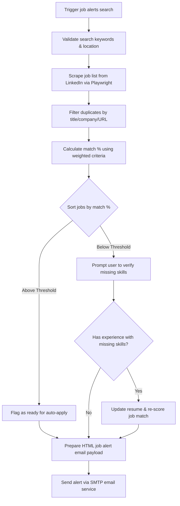

# Job Intelligence Agent Flowchart

This flowchart visualizes the job discovery, matching, and alerting logic.

```mermaid
graph TD
    Trigger[Trigger job alerts search] --> Validate[Validate search keywords & location]
    Validate --> Scrape[Scrape job list from LinkedIn via Playwright]
    Scrape --> Deduplicate[Filter duplicates by title/company/URL]
    Deduplicate --> ScoreMatches[Calculate match % using weighted criteria]
    
    ScoreMatches --> SegmentJobs{Sort jobs by match %}
    SegmentJobs -- Above Threshold --> AutoApplyQueue[Flag as ready for auto-apply]
    SegmentJobs -- Below Threshold --> LowerMatchReview[Prompt user to verify missing skills]
    
    AutoApplyQueue --> PrepAlert[Prepare HTML job alert email payload]
    LowerMatchReview --> UpdateResume{Has experience with missing skills?}
    UpdateResume -- Yes --> ReScore[Update resume & re-score job match]
    UpdateResume -- No --> PrepAlert
    ReScore --> PrepAlert
    
    PrepAlert --> SendEmail[Send alert via SMTP email service]
```
