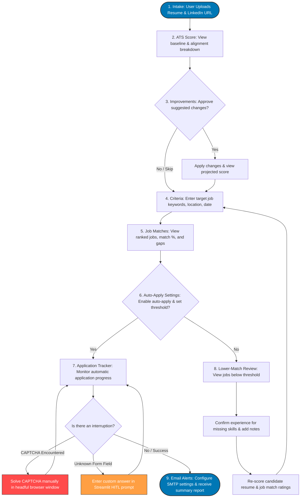

# Project Flowcharts: User & Technical Perspectives

This document visualizes the Resume to Job Application Agent System workflow from both the User Perspective (how a candidate interacts with the Streamlit wizard interface) and the Technical Perspective (how the hierarchical ADK agents, shared SQLite state, and decoupled background Playwright process interact).

---

## 1. User Perspective Flowchart

This diagram tracks the step-by-step user journey across the 9-step Streamlit UI workflow.



---

## 2. Technical System Architecture Flowchart

This diagram illustrates how the main Streamlit application thread, the SQLite shared state tables, the hierarchical ADK agents, and the decoupled background Playwright process communicate.

```mermaid
graph TB
    %% Define process groups
    subgraph Streamlit Frontend Process (Main Thread)
        UI[Streamlit Application UI]
        State[Session Cache / UI state]
    end

    subgraph ADK Multi-Agent Orchestration (LLM Decisions)
        Coord[Coordinator Agent]
        Resume[Resume Agent]
        JobIntel[Job Alerts / Job Intelligence Agent]
        AppAgent[Application Agent]
    end

    subgraph Database & Communication Layer
        DB[(SQLite Shared State)]
        HITL[(SQLite HITL Store)]
    end

    subgraph Decoupled Playwright Worker (Subprocess)
        Worker[Background Worker Engine]
        Scraper[Playwright Scraper]
        FormFiller[Heuristic Form Filler]
    end

    subgraph External Services
        SMTP[SMTP Email Server]
        JobSites[Job Portals: Greenhouse/Lever/Wellfound/LinkedIn]
    end

    %% Wiring flows
    UI -->|1. Upload profile data| Coord
    Coord -->|Delegates parsing| Resume
    Resume -->|Emulates style/templates| Resume
    Coord -->|Writes state records| DB
    
    UI -->|2. Search request| Coord
    Coord -->|Delegates discovery| JobIntel
    JobIntel -->|Triggers Playwright| Scraper
    Scraper -->|Scrapes listings| JobSites
    JobIntel -->|Calculates match weights| DB
    
    UI -->|3. Auto-apply trigger| Coord
    Coord -->|Delegates applications| AppAgent
    AppAgent -->|Spawns subprocess| Worker
    Worker -->|Queries job status| DB
    Worker -->|4. Navigate & Heuristics fill| FormFiller
    FormFiller -->|Upload PDF / Fill fields| JobSites

    %% Decoupled HITL loop
    FormFiller -->|5. CAPTCHA / Unknown Question| HITL
    HITL -->|6. Status updates / pending alerts| UI
    UI -->|7. User answers / solves| HITL
    HITL -->|8. Resumes worker loop| Worker
    
    %% Notifications
    JobIntel -->|9. Compiled HTML payload| SMTP
    SMTP -->|10. Dispatch Email| UserEmail([User Inbox])
```

---

## Key Technical Handoff Details

1. **State Isolation**: All state tables in SQLite (`candidate_profile`, `resume_versions`, `job_postings`, and `application_log`) are temporarily bound to the Streamlit run session ID and get reset on page reload/session refresh.
2. **Decoupled Playwright Execution**: When the `Application Agent` triggers an application run, it spawns the background worker as a subprocess. This prevents Playwright's `asyncio` event loop from locking Streamlit's primary process.
3. **Database Polling Loop**:
   - The **Playwright Worker** runs loops checking `HITL` state entries.
   - The **Streamlit UI** reads `HITL` records and uses `st.rerun()` or interval polling to display alerts or forms.
   - Updates to fields like `response_text` or status flags in the DB serve as the communication bridge.
