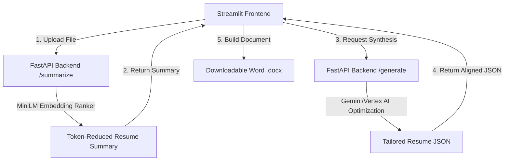

# Walkthrough - Talent Matcher Full-Stack Application

We have refactored the **FastAPI Backend Service (`talent_matcher`)** into a structured, agentic directory layout to separate concerns and facilitate expansion.

---

## Refactored Directory Structure

The backend code under [/talent_matcher](file:///Users/mahi/Documents/Kaggle%20AI%20Project/capstone-project/talent_matcher) is organized into the following layers:

- **[api/](file:///Users/mahi/Documents/Kaggle%20AI%20Project/capstone-project/talent_matcher/api)**: Defines FastAPI routing endpoints.
  - `routes.py`: Endpoint handlers for `/summarize`, `/generate`, `/history`, and `/health`.
- **[agents/](file:///Users/mahi/Documents/Kaggle%20AI%20Project/capstone-project/talent_matcher/agents)**: Houses autonomous system agent classes.
  - `resume_agent.py`: `ResumeTailoringAgent` class orchestrating LLM calls and fallback heuristics.
- **[tools/](file:///Users/mahi/Documents/Kaggle%20AI%20Project/capstone-project/talent_matcher/tools)**: Core operations tools used by agents/endpoints.
  - `parser_tool.py`: File text extraction parser.
  - `summarizer_tool.py`: Sentence-Transformers MiniLM token reduction ranker.
- **[tasks/](file:///Users/mahi/Documents/Kaggle%20AI%20Project/capstone-project/talent_matcher/tasks)**: Encapsulates distinct job execution pipelines.
  - `match_tasks.py`: `SummarizationTask` and `ResumeGenerationTask` wrappers.
- **[prompts/](file:///Users/mahi/Documents/Kaggle%20AI%20Project/capstone-project/talent_matcher/prompts)**: Centralized prompt and system instruction templates.
  - `templates.py`: Holds formatting templates.
- **[memory/](file:///Users/mahi/Documents/Kaggle%20AI%20Project/capstone-project/talent_matcher/memory)**: Session memory caching.
  - `session_memory.py`: Runtime cache to persist parsed profiles and history logs.
- **[config/](file:///Users/mahi/Documents/Kaggle%20AI%20Project/capstone-project/talent_matcher/config)**: Client-side property configurations.
  - `config.properties`: Exposes parameters such as `clientId`, `geminiModel`, `serverHost`, and `serverPort`.
  - `config_loader.py`: Exposes a custom `PropertiesConfig` class to parse properties.
- **`run.py`**: Refactored entrypoint script containing local path additions and dynamic port bindings.

---

## Architecture Overview

## Completed Work

### 1. Refactored Backend Architecture
- Structured the `talent_matcher` application using modular directories (`api/`, `agents/`, `tools/`, `tasks/`, `prompts/`, `memory/`, `config/`).
- Added a `run.py` entry point that configures `sys.path` to seamlessly load the internal module packages.
- Configured logging effectively across the application.

### 2. Semantic Resume Summarization
- Integrated `sentence-transformers` (`all-MiniLM-L6-v2`) to summarize candidate resumes efficiently.
- Deployed a mechanism to prune non-essential text to optimize token usage prior to sending it to the LLM.

### 3. Google GenAI (Gemini) Integration
- Upgraded `resume_agent.py` to use `google.generativeai` correctly to format customized resumes based on job descriptions and the semantic resume summaries.
- Enhanced robustness with a heuristic fallback mechanism to ensure it gracefully handles missing API keys or Gemini parsing issues.

### 4. Configuration Management
- Standardized configuration variables using a `.properties` file strategy.
- Created robust properties parsers to enforce types and centralize parameter changes (like `geminiModel`, server ports, etc.).
- Extended this configuration pattern to the Streamlit frontend.

### 5. Deployment Scaffolding for Agent Runtime
- Used `agents-cli scaffold enhance . --deployment-target agent_runtime` to generate the production deployment files.
- Provisioned the necessary `deployment/terraform` files, `agents-cli-manifest.yaml`, and baseline boilerplate.
- **Note:** The existing architecture uses raw `google.generativeai` and custom directories, while the CLI scaffold defaults to expecting an ADK `app/` folder. The logic will need to be ported to `app/agent.py` or configured to integrate with the ADK runtime in subsequent steps.

### 6. API Key Authorization Layer
- Secured the FastAPI backend endpoints (`/summarize`, `/generate`, `/history`) by enforcing an `X-API-Key` header requirement via FastAPI's `Security` dependencies.
- Updated `config.properties` in the backend and `resources.properties` in the frontend to include a shared `apiKey`.
- Modified the Streamlit frontend (`app.py`) to retrieve the `apiKey` and attach it automatically to the `requests.post()` calls directed at the backend.

### 7. ADK Agent Migration
- Refactored `talent_matcher/app/agent.py` to expose the generative capabilities as a conversational "Recruiter Assistant" agent.
- Created `talent_matcher/app/tools.py` containing the `generate_tailored_resume` ADK Tool, bridging the underlying `ResumeTailoringAgent` logic with the ADK runtime.
- You can now test the ADK-compatible conversational agent locally using `agents-cli playground`.

### 8. Multi-Agent Expansion (Interview Prep Agent)
- Added an **Interview Prep Agent** utilizing the ADK Delegation pattern.
- The `root_agent` now acts as a **Talent Coordinator**, capable of dynamically routing tasks to either the `resume_tailorer` or the `interview_prep_agent` sub-agents based on the user's conversational intent.
- Added a `POST /prep` backend endpoint and updated the Streamlit dashboard to include a new **🗣️ Interview Prep** tab, allowing recruiters to instantly generate technical and behavioral interview questions tailored to a specific candidate's gaps.

---

## Frontend Application (`resume-matcher`)
- **[app.py](file:///Users/mahi/Documents/Kaggle%20AI%20Project/capstone-project/resume-matcher/app.py)**: 
  - Integrated HTTP requests to backend ports.
  - **Resume Tailoring Tab**: Allows uploading a draft resume, pasting the target job requirements, and clicking a button to process and export the tailored `.docx` document straight from the dashboard.
- **[resources.properties](file:///Users/mahi/Documents/Kaggle%20AI%20Project/capstone-project/resume-matcher/resources.properties)**: Externalizes configuration values such as the backend API URL (`backendUrl`).

---

## Deployment & Verification

Both services are active:
- **FastAPI Backend (Swagger Docs)**: [http://localhost:8000/docs](http://localhost:8000/docs) (served via `python3 run.py`)
- **Streamlit Frontend**: [http://localhost:8501](http://localhost:8501)
